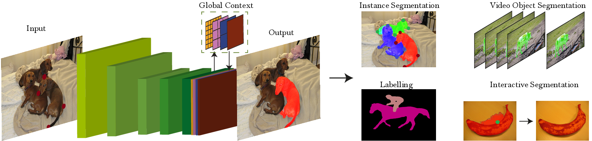

# Deep Extreme Cut (DEXTR)
Visit our [project page](http://www.vision.ee.ethz.ch/~cvlsegmentation/dextr) for accessing the paper, and the pre-computed results.



This is the implementation of our work `Deep Extreme Cut (DEXTR)`, for object segmentation from extreme points.

#### This code was ported to PyTorch 0.4.0! For the previous version of the code with Pytorch 0.3.1, please checkout [this branch](https://github.com/scaelles/DEXTR-PyTorch/tree/PyTorch-0.3.1).
#### NEW: Keras with Tensorflow backend implementation also available: [DEXTR-KerasTensorflow](https://github.com/scaelles/DEXTR-KerasTensorflow )!

### Abstract
This paper explores the use of extreme points in an object (left-most, right-most, top, bottom pixels) as input to obtain precise object segmentation for images and videos. We do so by adding an extra channel to the image in the input of a convolutional neural network (CNN), which contains a Gaussian centered in each of the extreme points. The CNN learns to transform this information into a segmentation of an object that matches those extreme points. We demonstrate the usefulness of this approach for guided segmentation (grabcut-style), interactive segmentation, video object segmentation, and dense segmentation annotation. We show that we obtain the most precise results to date, also with less user input, in an extensive and varied selection of benchmarks and datasets.

### Installation
The code was tested with [Miniconda](https://conda.io/miniconda.html) and Python 3.6. After installing the Miniconda environment:


0. Clone the repo:
    ```Shell
    git clone https://github.com/scaelles/DEXTR-PyTorch
    cd DEXTR-PyTorch
    ```
 
1. Install dependencies:
    ```Shell
    conda install pytorch torchvision -c pytorch
    conda install matplotlib opencv pillow scikit-learn scikit-image
    ```
  
2. Download the model by running the script inside ```models/```:
    ```Shell
    cd models/
    chmod +x download_dextr_model.sh
    ./download_dextr_model.sh
    cd ..
    ```
    The default model is trained on PASCAL VOC Segmentation train + SBD (10582 images). To download models trained on PASCAL VOC Segmentation train or COCO, please visit our [project page](http://www.vision.ee.ethz.ch/~cvlsegmentation/dextr/#downloads), or keep scrolling till the end of this README.

3. To try the demo version of DEXTR, please run:
    ```Shell
    python demo.py
    ```
If installed correctly, the result should look like this:
<p align="center"></p>

To train and evaluate DEXTR on PASCAL (or PASCAL + SBD), please follow these additional steps:

4. Install tensorboard (integrated with PyTorch). 
    ```Shell
    pip install tensorboard tensorboardx
    ```

5. Download the pre-trained PSPNet model for semantic segmentation, taken from [this](https://github.com/isht7/pytorch-deeplab-resnet) repository.
    ```Shell
    cd models/
    chmod +x download_pretrained_psp_model.sh
    ./download_pretrained_psp_model.sh
    cd ..
    ```
6. Set the paths in ```mypath.py```, so that they point to the location of PASCAL/SBD dataset.

7. Run ```python train_pascal.py```, after changing the default parameters, if necessary (eg. gpu_id).

Enjoy!!

### Pre-trained models
You can use the following DEXTR models under MIT license as pre-trained on:
  * [PASCAL + SBD](https://data.vision.ee.ethz.ch/kmaninis/share/DEXTR/Downloads/models/dextr_pascal-sbd.pth), trained on PASCAL VOC Segmentation train + SBD (10582 images). Achieves mIoU of 91.5% on PASCAL VOC Segmentation val.
  * [PASCAL](https://data.vision.ee.ethz.ch/kmaninis/share/DEXTR/Downloads/models/dextr_pascal.pth), trained on PASCAL VOC Segmentation train (1464 images). Achieves mIoU of 90.5% on PASCAL VOC Segmentation val.
  * [COCO](https://data.vision.ee.ethz.ch/kmaninis/share/DEXTR/Downloads/models/dextr_coco.pth), trained on COCO train 2014 (82783 images). Achieves mIoU of 87.8% on PASCAL VOC Segmentation val.

### Citation
If you use this code, please consider citing the following papers:

	@Inproceedings{Man+18,
	  Title          = {Deep Extreme Cut: From Extreme Points to Object Segmentation},
	  Author         = {K.K. Maninis and S. Caelles and J. Pont-Tuset and L. {Van Gool}},
	  Booktitle      = {Computer Vision and Pattern Recognition (CVPR)},
	  Year           = {2018}
	}

	@InProceedings{Pap+17,
	  Title          = {Extreme clicking for efficient object annotation},
	  Author         = {D.P. Papadopoulos and J. Uijlings and F. Keller and V. Ferrari},
	  Booktitle      = {ICCV},
	  Year           = {2017}
	}


We thank the authors of [pytorch-deeplab-resnet](https://github.com/isht7/pytorch-deeplab-resnet) for making their PyTorch re-implementation of DeepLab-v2 available!

If you encounter any problems please contact us at {kmaninis, scaelles}@vision.ee.ethz.ch.
